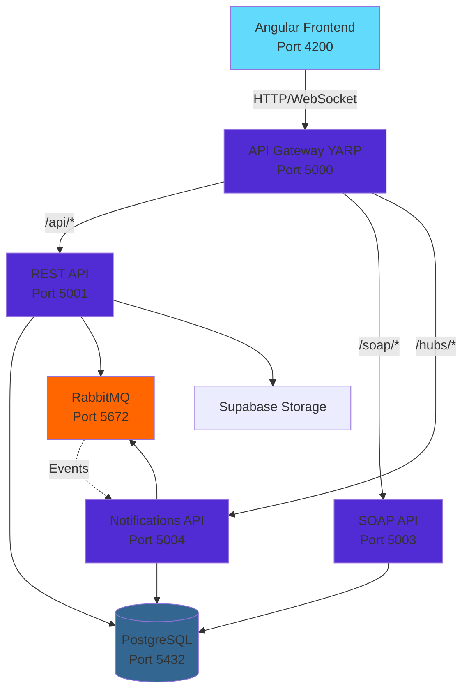
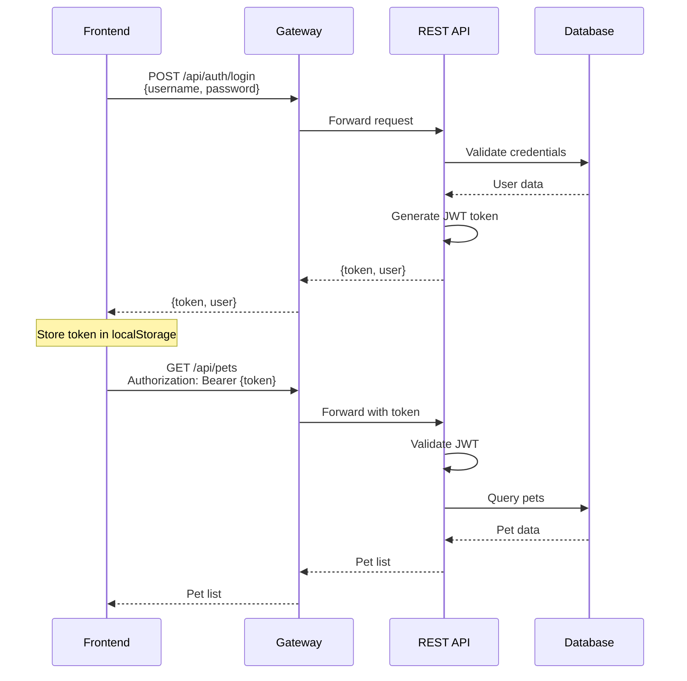
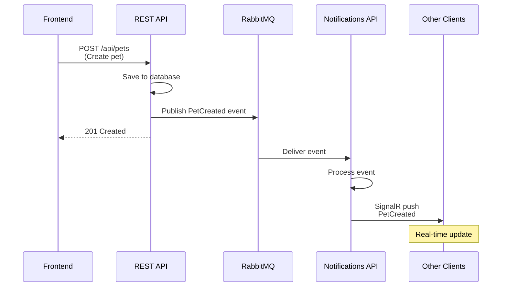

# PetFoundation Integration Guide

This guide explains how to integrate the frontend with the backend services, including architecture overview, API endpoints, authentication, and real-time notifications.

## Table of Contents
- [Architecture Overview](#architecture-overview)
- [Service Communication](#service-communication)
- [API Gateway Routing](#api-gateway-routing)
- [Authentication Flow](#authentication-flow)
- [Frontend Integration Steps](#frontend-integration-steps)
- [Real-time Notifications](#real-time-notifications)
- [Message Queue Integration](#message-queue-integration)
- [API Reference](#api-reference)

## Architecture Overview

The PetFoundation application follows a microservices architecture:



### Components

| Component | Technology | Purpose |
|-----------|-----------|---------|
| **Frontend** | Angular 17 | User interface |
| **API Gateway** | YARP (Yet Another Reverse Proxy) | Request routing, load balancing |
| **REST API** | ASP.NET Core 10.0 | Main business logic, CRUD operations |
| **SOAP API** | ASP.NET Core 10.0 | Legacy SOAP web services |
| **Notifications API** | ASP.NET Core 10.0 + SignalR | Real-time notifications |
| **PostgreSQL** | Database 16 | Data persistence |
| **RabbitMQ** | Message Broker 3 | Asynchronous messaging |
| **Supabase** | Cloud Storage | Image/file storage |

## Service Communication

### Synchronous Communication
- **Frontend → Gateway**: HTTP/HTTPS requests
- **Gateway → Backend Services**: HTTP reverse proxy
- **Backend → Database**: Entity Framework Core

### Asynchronous Communication
- **REST API → RabbitMQ**: Publishes events (e.g., pet created, updated)
- **Notifications API → RabbitMQ**: Consumes events
- **Notifications API → Frontend**: SignalR WebSocket push

## API Gateway Routing

The gateway routes requests based on path prefixes:

| Path Pattern | Target Service | Example |
|-------------|----------------|---------|
| `/api/**` | REST API (5001) | `/api/pets`, `/api/auth/login` |
| `/soap/**` | SOAP API (5003) | `/soap/Service.asmx` |
| `/hubs/**` | Notifications API (5004) | `/hubs/notifications` |

### Configuration

The gateway is configured in [`appsettings.json`](file:///Users/alexpadilla/projects/webapps/Proyecto_WebAvanzadas/Backend/src/ApiPetFoundation.Gateway/appsettings.json):

```json
{
  "ReverseProxy": {
    "Routes": {
      "rest-api": {
        "ClusterId": "rest-cluster",
        "Match": { "Path": "/api/{**catch-all}" }
      },
      "soap-api": {
        "ClusterId": "soap-cluster",
        "Match": { "Path": "/soap/{**catch-all}" }
      },
      "notifications-hubs": {
        "ClusterId": "notifications-cluster",
        "Match": { "Path": "/hubs/{**catch-all}" }
      }
    }
  }
}
```

## Authentication Flow

The application uses **JWT (JSON Web Tokens)** for authentication.

### Flow Diagram



### JWT Configuration

All backend services share the same JWT configuration:

```json
{
  "Jwt": {
    "Key": "h2G8pF83mG93n1L0pZ0kC92fW2HkS5A1zY9cM0xV3tE8rU1wL3R9bP5hG6F2nD4yQ",
    "Issuer": "ApiPetFoundation",
    "Audience": "ApiPetFoundationClient"
  }
}
```

> [!WARNING]
> The JWT key shown above is for development only. **Never use this key in production!** Generate a new secure key for production environments.

## Frontend Integration Steps

### Step 1: Configure API Base URL

Create an environment configuration file for the Angular app:

**`Proyecto-PetFoundation/src/environments/environment.ts`**
```typescript
export const environment = {
  production: false,
  apiUrl: 'http://localhost:5000/api',
  hubUrl: 'http://localhost:5000/hubs'
};
```

**`Proyecto-PetFoundation/src/environments/environment.prod.ts`**
```typescript
export const environment = {
  production: true,
  apiUrl: '/api',  // Relative URL when using nginx proxy
  hubUrl: '/hubs'
};
```

### Step 2: Create HTTP Interceptor for JWT

**`src/app/interceptors/auth.interceptor.ts`**
```typescript
import { Injectable } from '@angular/core';
import { HttpInterceptor, HttpRequest, HttpHandler, HttpEvent } from '@angular/common/http';
import { Observable } from 'rxjs';

@Injectable()
export class AuthInterceptor implements HttpInterceptor {
  intercept(req: HttpRequest<any>, next: HttpHandler): Observable<HttpEvent<any>> {
    const token = localStorage.getItem('authToken');
    
    if (token) {
      const cloned = req.clone({
        headers: req.headers.set('Authorization', `Bearer ${token}`)
      });
      return next.handle(cloned);
    }
    
    return next.handle(req);
  }
}
```

Register in `app.config.ts`:
```typescript
import { provideHttpClient, withInterceptors } from '@angular/common/http';
import { AuthInterceptor } from './interceptors/auth.interceptor';

export const appConfig: ApplicationConfig = {
  providers: [
    provideHttpClient(withInterceptors([AuthInterceptor]))
  ]
};
```

### Step 3: Create Authentication Service

**`src/app/services/auth.service.ts`**
```typescript
import { Injectable } from '@angular/core';
import { HttpClient } from '@angular/common/http';
import { Observable, BehaviorSubject } from 'rxjs';
import { tap } from 'rxjs/operators';
import { environment } from '../../environments/environment';

interface LoginRequest {
  username: string;
  password: string;
}

interface LoginResponse {
  token: string;
  user: {
    id: string;
    username: string;
    email: string;
  };
}

@Injectable({ providedIn: 'root' })
export class AuthService {
  private currentUserSubject = new BehaviorSubject<any>(null);
  public currentUser$ = this.currentUserSubject.asObservable();

  constructor(private http: HttpClient) {
    const user = localStorage.getItem('currentUser');
    if (user) {
      this.currentUserSubject.next(JSON.parse(user));
    }
  }

  login(credentials: LoginRequest): Observable<LoginResponse> {
    return this.http.post<LoginResponse>(
      `${environment.apiUrl}/auth/login`,
      credentials
    ).pipe(
      tap(response => {
        localStorage.setItem('authToken', response.token);
        localStorage.setItem('currentUser', JSON.stringify(response.user));
        this.currentUserSubject.next(response.user);
      })
    );
  }

  logout(): void {
    localStorage.removeItem('authToken');
    localStorage.removeItem('currentUser');
    this.currentUserSubject.next(null);
  }

  isAuthenticated(): boolean {
    return !!localStorage.getItem('authToken');
  }
}
```

### Step 4: Create API Service for Pets

**`src/app/services/pet.service.ts`**
```typescript
import { Injectable } from '@angular/core';
import { HttpClient } from '@angular/common/http';
import { Observable } from 'rxjs';
import { environment } from '../../environments/environment';

export interface Pet {
  id: string;
  name: string;
  species: string;
  breed: string;
  age: number;
  description: string;
  imageUrl?: string;
  status: 'Available' | 'Adopted' | 'Pending';
  createdAt: Date;
}

@Injectable({ providedIn: 'root' })
export class PetService {
  private apiUrl = `${environment.apiUrl}/pets`;

  constructor(private http: HttpClient) {}

  getPets(): Observable<Pet[]> {
    return this.http.get<Pet[]>(this.apiUrl);
  }

  getPet(id: string): Observable<Pet> {
    return this.http.get<Pet>(`${this.apiUrl}/${id}`);
  }

  createPet(pet: Partial<Pet>): Observable<Pet> {
    return this.http.post<Pet>(this.apiUrl, pet);
  }

  updatePet(id: string, pet: Partial<Pet>): Observable<Pet> {
    return this.http.put<Pet>(`${this.apiUrl}/${id}`, pet);
  }

  deletePet(id: string): Observable<void> {
    return this.http.delete<void>(`${this.apiUrl}/${id}`);
  }

  uploadImage(petId: string, file: File): Observable<{ imageUrl: string }> {
    const formData = new FormData();
    formData.append('file', file);
    return this.http.post<{ imageUrl: string }>(
      `${this.apiUrl}/${petId}/image`,
      formData
    );
  }
}
```

## Real-time Notifications

The Notifications API uses **SignalR** for real-time communication.

### SignalR Integration

**Install SignalR client:**
```bash
npm install @microsoft/signalr
```

**Create notification service:**

**`src/app/services/notification.service.ts`**
```typescript
import { Injectable } from '@angular/core';
import * as signalR from '@microsoft/signalr';
import { BehaviorSubject, Observable } from 'rxjs';
import { environment } from '../../environments/environment';

export interface Notification {
  id: string;
  message: string;
  type: 'info' | 'success' | 'warning' | 'error';
  timestamp: Date;
  data?: any;
}

@Injectable({ providedIn: 'root' })
export class NotificationService {
  private hubConnection: signalR.HubConnection;
  private notificationsSubject = new BehaviorSubject<Notification[]>([]);
  public notifications$ = this.notificationsSubject.asObservable();

  constructor() {
    this.hubConnection = new signalR.HubConnectionBuilder()
      .withUrl(`${environment.hubUrl}/notifications`, {
        accessTokenFactory: () => localStorage.getItem('authToken') || ''
      })
      .withAutomaticReconnect()
      .build();

    this.setupEventHandlers();
  }

  private setupEventHandlers(): void {
    this.hubConnection.on('ReceiveNotification', (notification: Notification) => {
      const current = this.notificationsSubject.value;
      this.notificationsSubject.next([notification, ...current]);
    });

    this.hubConnection.on('PetCreated', (pet: any) => {
      this.addNotification({
        id: crypto.randomUUID(),
        message: `New pet available: ${pet.name}`,
        type: 'info',
        timestamp: new Date(),
        data: pet
      });
    });

    this.hubConnection.on('PetUpdated', (pet: any) => {
      this.addNotification({
        id: crypto.randomUUID(),
        message: `Pet updated: ${pet.name}`,
        type: 'info',
        timestamp: new Date(),
        data: pet
      });
    });
  }

  async start(): Promise<void> {
    try {
      await this.hubConnection.start();
      console.log('SignalR connected');
    } catch (err) {
      console.error('SignalR connection error:', err);
      setTimeout(() => this.start(), 5000); // Retry after 5 seconds
    }
  }

  async stop(): Promise<void> {
    await this.hubConnection.stop();
  }

  private addNotification(notification: Notification): void {
    const current = this.notificationsSubject.value;
    this.notificationsSubject.next([notification, ...current]);
  }
}
```

**Start connection on app initialization:**

**`src/app/app.component.ts`**
```typescript
import { Component, OnInit, OnDestroy } from '@angular/core';
import { NotificationService } from './services/notification.service';

@Component({
  selector: 'app-root',
  templateUrl: './app.component.html'
})
export class AppComponent implements OnInit, OnDestroy {
  constructor(private notificationService: NotificationService) {}

  async ngOnInit() {
    await this.notificationService.start();
  }

  async ngOnDestroy() {
    await this.notificationService.stop();
  }
}
```

## Message Queue Integration

### Event Flow



### RabbitMQ Configuration

**Exchange**: `petfoundation.events` (Topic exchange)
**Queue**: `notifications.pets`
**Routing Keys**:
- `pet.created`
- `pet.updated`
- `pet.deleted`
- `pet.adopted`

### Event Publishing (Backend)

The REST API publishes events to RabbitMQ when pets are created/updated:

```csharp
// Example event publishing in REST API
public async Task<IActionResult> CreatePet(CreatePetDto dto)
{
    var pet = await _petService.CreateAsync(dto);
    
    // Publish event to RabbitMQ
    await _messageBus.PublishAsync("pet.created", new PetCreatedEvent
    {
        PetId = pet.Id,
        Name = pet.Name,
        Species = pet.Species,
        CreatedAt = DateTime.UtcNow
    });
    
    return CreatedAtAction(nameof(GetPet), new { id = pet.Id }, pet);
}
```

### Event Consumption (Notifications API)

The Notifications API consumes events and broadcasts via SignalR:

```csharp
// Example event consumer in Notifications API
public class PetEventConsumer : BackgroundService
{
    protected override async Task ExecuteAsync(CancellationToken stoppingToken)
    {
        await _rabbitMqService.ConsumeAsync<PetCreatedEvent>(
            "notifications.pets",
            async (event) =>
            {
                await _hubContext.Clients.All.SendAsync(
                    "PetCreated",
                    event,
                    stoppingToken
                );
            },
            stoppingToken
        );
    }
}
```

## API Reference

### Authentication Endpoints

| Method | Endpoint | Description | Request Body | Response |
|--------|----------|-------------|--------------|----------|
| POST | `/api/auth/register` | Register new user | `{username, email, password}` | `{user, token}` |
| POST | `/api/auth/login` | Login | `{username, password}` | `{user, token}` |
| POST | `/api/auth/refresh` | Refresh token | `{refreshToken}` | `{token}` |
| POST | `/api/auth/logout` | Logout | - | `204 No Content` |

### Pet Endpoints

| Method | Endpoint | Description | Auth Required |
|--------|----------|-------------|---------------|
| GET | `/api/pets` | List all pets | No |
| GET | `/api/pets/{id}` | Get pet by ID | No |
| POST | `/api/pets` | Create new pet | Yes |
| PUT | `/api/pets/{id}` | Update pet | Yes |
| DELETE | `/api/pets/{id}` | Delete pet | Yes |
| POST | `/api/pets/{id}/image` | Upload pet image | Yes |
| GET | `/api/pets/search?query={q}` | Search pets | No |

### SOAP Endpoints

Access WSDL at: `http://localhost:5003/Service.asmx?wsdl`

### SignalR Hub Methods

**Client → Server:**
- `JoinGroup(groupName)` - Join notification group
- `LeaveGroup(groupName)` - Leave notification group

**Server → Client:**
- `ReceiveNotification(notification)` - General notification
- `PetCreated(pet)` - New pet created
- `PetUpdated(pet)` - Pet updated
- `PetAdopted(pet)` - Pet adopted

## Testing Integration

### Test REST API
```bash
# Login
curl -X POST http://localhost:5000/api/auth/login \
  -H "Content-Type: application/json" \
  -d '{"username":"test","password":"test123"}'

# Get pets (with token)
curl http://localhost:5000/api/pets \
  -H "Authorization: Bearer YOUR_TOKEN_HERE"
```

### Test SignalR Connection
Use browser console:
```javascript
const connection = new signalR.HubConnectionBuilder()
  .withUrl("http://localhost:5000/hubs/notifications")
  .build();

connection.on("PetCreated", (pet) => {
  console.log("New pet:", pet);
});

await connection.start();
```

## Next Steps

1. **Implement error handling**: Add global error interceptor for HTTP errors
2. **Add loading states**: Implement loading indicators for API calls
3. **Implement caching**: Use RxJS operators for client-side caching
4. **Add retry logic**: Implement exponential backoff for failed requests
5. **Monitor performance**: Add logging and analytics

## Additional Resources

- [ASP.NET Core Documentation](https://docs.microsoft.com/aspnet/core)
- [Angular Documentation](https://angular.io/docs)
- [SignalR Documentation](https://docs.microsoft.com/aspnet/core/signalr)
- [RabbitMQ Tutorials](https://www.rabbitmq.com/tutorials)
- [YARP Documentation](https://microsoft.github.io/reverse-proxy/)
