# C4 Level 3 - Component Diagram: REST API

This diagram shows the internal components of the REST API container, which implements the core business logic.

```mermaid
C4Component
  title Component Diagram - REST API (ApiPetFoundation.Api)

  Container(gateway, "API Gateway", "YARP", "Routes /api/** requests")
  ContainerDb(postgres, "PostgreSQL", "PostgreSQL 16", "Application data")
  ContainerQueue(rabbitmq, "RabbitMQ", "RabbitMQ 3", "Event broker")
  Container_Ext(supabase, "Supabase Storage", "Cloud", "Image storage")

  Container_Boundary(api, "REST API") {

    Component(authCtrl, "AuthController", "ASP.NET Core", "Login and registration endpoints")
    Component(petsCtrl, "PetsController", "ASP.NET Core", "Pet CRUD with pagination and filtering")
    Component(adoptionCtrl, "AdoptionRequestsController", "ASP.NET Core", "Adoption request workflow")
    Component(notifCtrl, "NotificationsController", "ASP.NET Core", "Notification retrieval and read status")
    Component(imagesCtrl, "PetImagesController", "ASP.NET Core", "Pet image upload endpoint")

    Component(authService, "AuthService", "Application Layer", "JWT authentication and Identity management")
    Component(petService, "PetService", "Application Layer", "Pet business logic and validation")
    Component(adoptionService, "AdoptionRequestService", "Application Layer", "Adoption workflow state machine")
    Component(notifService, "NotificationService", "Application Layer", "Notification persistence")
    Component(userService, "UserProfileService", "Application Layer", "Domain user profile management")

    Component(petRepo, "PetRepository", "EF Core", "Pet data access with eager loading")
    Component(adoptionRepo, "AdoptionRequestRepository", "EF Core", "Adoption request data access")
    Component(notifRepo, "NotificationRepository", "EF Core", "Notification data access")
    Component(userRepo, "UserRepository", "EF Core", "User data access")

    Component(eventPublisher, "RabbitMqEventPublisher", "RabbitMQ.Client", "Publishes domain events")
    Component(storageService, "SupabaseStorageService", "HttpClient", "Uploads images to Supabase")

  }

  Rel(gateway, authCtrl, "POST /api/auth/*", "JSON/HTTP")
  Rel(gateway, petsCtrl, "GET/POST/PUT/PATCH/DELETE /api/pets", "JSON/HTTP")
  Rel(gateway, adoptionCtrl, "GET/POST /api/adoptionrequests", "JSON/HTTP")
  Rel(gateway, notifCtrl, "GET/POST /api/notifications", "JSON/HTTP")
  Rel(gateway, imagesCtrl, "POST /api/pets/:id/image", "Multipart/HTTP")

  Rel(authCtrl, authService, "Delegates to")
  Rel(petsCtrl, petService, "Delegates to")
  Rel(adoptionCtrl, adoptionService, "Delegates to")
  Rel(notifCtrl, notifService, "Delegates to")
  Rel(imagesCtrl, storageService, "Delegates to")

  Rel(petService, petRepo, "Reads/writes pets")
  Rel(adoptionService, adoptionRepo, "Reads/writes requests")
  Rel(notifService, notifRepo, "Reads/writes notifications")
  Rel(authService, userService, "Creates user profile")
  Rel(userService, userRepo, "Reads/writes users")

  Rel(petService, eventPublisher, "Publishes PetCreated")
  Rel(adoptionService, eventPublisher, "Publishes AdoptionStatusChanged, AdoptionRequestCreated")

  Rel(petRepo, postgres, "Queries", "Npgsql")
  Rel(adoptionRepo, postgres, "Queries", "Npgsql")
  Rel(notifRepo, postgres, "Queries", "Npgsql")
  Rel(userRepo, postgres, "Queries", "Npgsql")
  Rel(eventPublisher, rabbitmq, "Publishes events", "AMQP")
  Rel(storageService, supabase, "Uploads images", "HTTPS")

  UpdateLayoutConfig($c4ShapeInRow="5", $c4BoundaryInRow="1")
```

## Clean Architecture Layers

The REST API follows Clean Architecture with these layers:

### Controllers (Presentation)
| Controller | Routes | Auth | Purpose |
|-----------|--------|------|---------|
| AuthController | `/api/auth/register`, `/api/auth/login` | Public | User registration and login |
| PetsController | `/api/pets/**` | Public read, Admin write | Pet CRUD with filtering |
| AdoptionRequestsController | `/api/adoptionrequests/**` | Authenticated | Adoption workflow management |
| NotificationsController | `/api/notifications/**` | Authenticated | Notification retrieval |
| PetImagesController | `/api/pets/:id/image` | Admin | Image upload to Supabase |

### Services (Application)
| Service | Responsibility |
|---------|---------------|
| AuthService | JWT token generation, ASP.NET Identity integration, user profile creation |
| PetService | Pet CRUD, validation, status management, event publishing |
| AdoptionRequestService | State machine (Pending -> Approved/Rejected/Cancelled), event publishing |
| NotificationService | Notification persistence and retrieval |
| UserProfileService | Domain user profile linked to Identity user |

### Repositories (Infrastructure)
| Repository | Entity | Special Features |
|-----------|--------|-----------------|
| PetRepository | Pet | Eager loading of PetImages, advanced filtering/pagination |
| AdoptionRequestRepository | AdoptionRequest | Includes Pet and User navigation properties |
| NotificationRepository | Notification | Filtered by userId |
| UserRepository | User | Links to Identity system |

### External Integrations
| Integration | Technology | Purpose |
|-------------|-----------|---------|
| RabbitMqEventPublisher | RabbitMQ.Client | Publishes PetCreated, AdoptionStatusChanged, AdoptionRequestCreated |
| SupabaseStorageService | HttpClient | Uploads images to Supabase bucket, returns public URLs |
