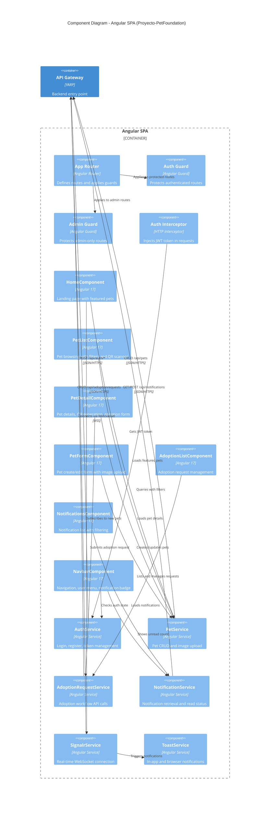

# C4 Level 3 - Component Diagram: Angular SPA

This diagram shows the internal components of the Angular frontend application.



## Frontend Architecture

### Routing & Guards

| Route | Component | Guard | Access |
|-------|-----------|-------|--------|
| `/` | HomeComponent | None | Public |
| `/login` | LoginComponent | None | Public |
| `/register` | RegisterComponent | None | Public |
| `/pets` | PetListComponent | None | Public |
| `/pets/create` | PetFormComponent | adminGuard | Admin only |
| `/pets/:id` | PetDetailComponent | None | Public |
| `/pets/:id/edit` | PetFormComponent | adminGuard | Admin only |
| `/adoption-requests` | AdoptionListComponent | authGuard | Authenticated |
| `/notifications` | NotificationsComponent | authGuard | Authenticated |

### Services

| Service | State Management | API Endpoints |
|---------|-----------------|---------------|
| **AuthService** | BehaviorSubject for currentUser, localStorage for token | `/api/auth/login`, `/api/auth/register`, `/api/auth/me` |
| **PetService** | Stateless (per-request) | `/api/pets/**` |
| **AdoptionRequestService** | Stateless (per-request) | `/api/adoptionrequests/**` |
| **NotificationService** | Stateless (per-request) | `/api/notifications/**` |
| **SignalrService** | RxJS Subjects for real-time events | WebSocket `/hubs/notifications` |
| **ToastService** | Observable toast queue | N/A (UI only) |

### Real-Time Flow

```
RabbitMQ → Notifications Service → SignalR Hub → WebSocket → SignalrService → Components
                                                                           → ToastService → Browser Notification API
```
