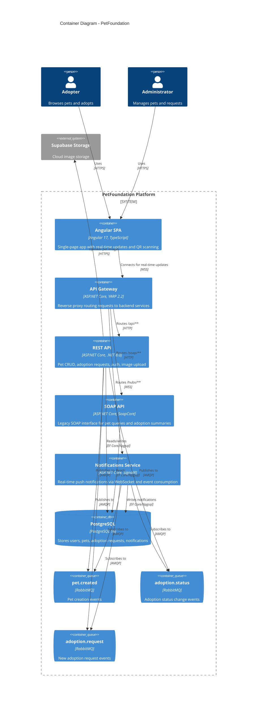

# C4 Level 2 - Container Diagram

This diagram shows the deployable containers that compose the PetFoundation platform.



## Container Descriptions

| Container | Technology | Port | Purpose |
|-----------|-----------|------|---------|
| **Angular SPA** | Angular 17, TypeScript, SignalR client | 4200 (dev) | Frontend with reactive UI, QR scanning, real-time notifications |
| **API Gateway** | ASP.NET Core, YARP | 5000 | Reverse proxy routing all external traffic to internal services |
| **REST API** | ASP.NET Core, EF Core, FluentValidation | 5001 | Business logic: pet management, adoption workflow, auth, image upload |
| **SOAP API** | ASP.NET Core, SoapCore | 5003 | Legacy interface for pet queries and adoption summary reports |
| **Notifications Service** | ASP.NET Core, SignalR, RabbitMQ consumer | 5004 | Consumes domain events, persists notifications, pushes real-time updates |
| **PostgreSQL** | PostgreSQL 16 | 5432 | Primary datastore with `identity` and `app` schemas |
| **RabbitMQ** | RabbitMQ 3 | 5672 | Event broker with `petfoundation.events` exchange |

## Request Flow

```
Browser → API Gateway (5000)
            ├── /api/**  → REST API (5001) → PostgreSQL + Supabase + RabbitMQ
            ├── /soap/** → SOAP API (5003) → PostgreSQL
            └── /hubs/** → Notifications (5004) ← RabbitMQ → SignalR → Browser
```
