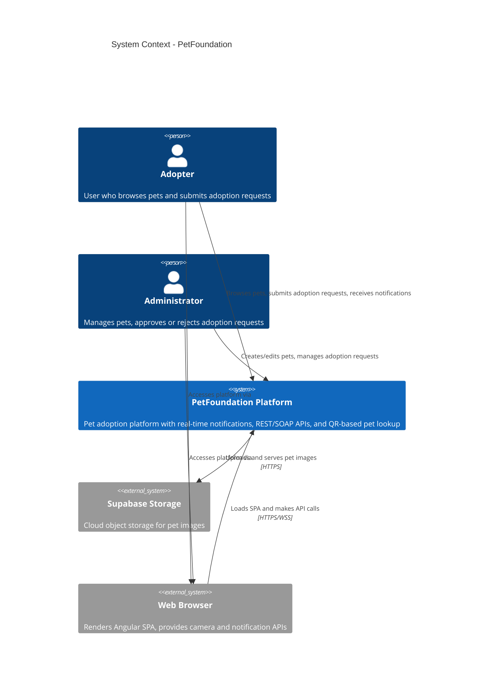

# C4 Level 1 - System Context Diagram

This diagram shows the PetFoundation system and its interactions with external actors and systems.

## Key Actors

| Actor | Role | Key Actions |
|-------|------|-------------|
| **Adopter** | Registered user | Browse pets, view details via QR, submit adoption requests, receive real-time notifications |
| **Administrator** | Admin role | Create/edit/delete pets, upload images, approve/reject adoption requests |

## External Systems

| System | Purpose | Integration |
|--------|---------|-------------|
| **Supabase Storage** | Cloud storage for pet images | REST API with Service Role Key authentication |
| **Web Browser** | Client runtime | Renders Angular SPA, provides Camera API (QR scanning) and Notification API (browser alerts) |
