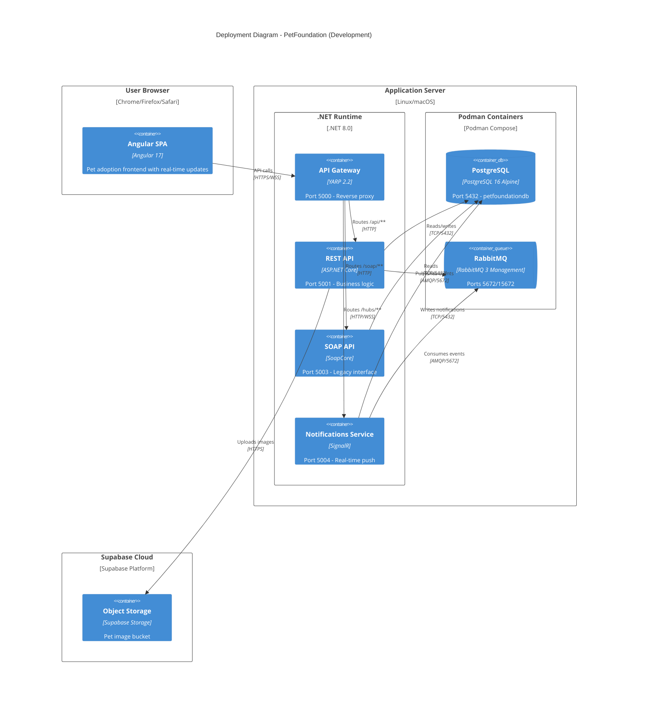

# C4 Level 4 - Deployment Diagram

This diagram shows how the PetFoundation containers are deployed in the development/production environment.



## Port Mapping

| Service | Port | Protocol | Notes |
|---------|------|----------|-------|
| Angular Dev Server | 4200 | HTTPS | Proxies to Gateway |
| API Gateway (YARP) | 5000 | HTTPS | Single entry point for all backend services |
| REST API | 5001 | HTTPS | Internal, accessed via Gateway |
| SOAP API | 5003 | HTTPS | Internal, accessed via Gateway |
| Notifications API | 5004 | HTTPS/WSS | Internal, accessed via Gateway |
| PostgreSQL | 5432 | TCP | Container: petfoundation-postgres |
| RabbitMQ (AMQP) | 5672 | TCP | Container: petfoundation-rabbitmq |
| RabbitMQ (Management) | 15672 | HTTP | Admin UI for queue monitoring |

## Infrastructure as Code

Infrastructure services are defined in `compose.yaml` and managed via Makefile:

```
make infra-up       # Start PostgreSQL + RabbitMQ containers
make backend        # Start all 4 .NET services
make frontend       # Start Angular dev server
make start-all      # Start everything
```

## Database Schemas

PostgreSQL uses two schemas:

| Schema | Tables | Purpose |
|--------|--------|---------|
| `identity` | AspNetUsers, AspNetRoles, AspNetUserRoles, etc. | ASP.NET Core Identity |
| `app` | Users, Pets, PetImages, AdoptionRequests, Notifications | Domain data |
