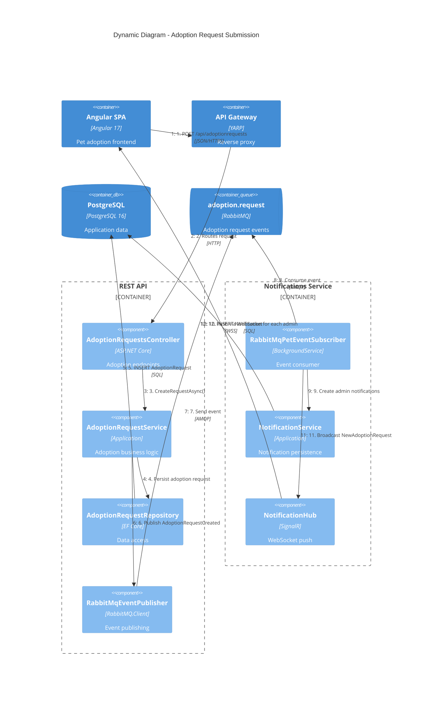
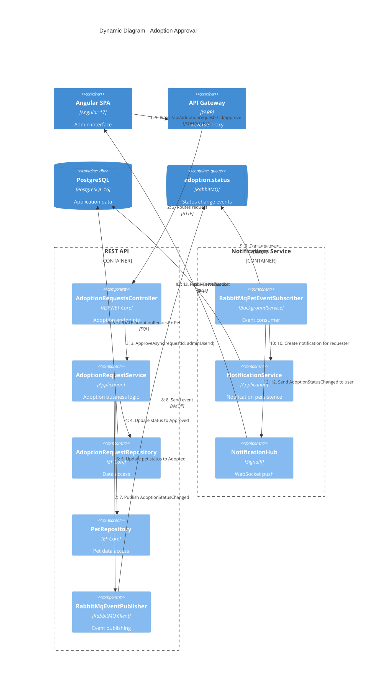

# C4 Dynamic Diagram - Adoption Request Flow

This diagram shows the sequence of interactions when a user submits an adoption request and an administrator approves it.

## Adoption Request Submission



## Adoption Approval



## State Machine

The adoption request follows this state machine:

```
                  ┌─────────┐
                  │ Pending │
                  └────┬────┘
           ┌──────────┼──────────┐
           ▼          ▼          ▼
      ┌─────────┐ ┌─────────┐ ┌───────────┐
      │ Approved│ │ Rejected│ │ Cancelled │
      └─────────┘ └─────────┘ └───────────┘
         (admin)    (admin)    (user/admin)
```

| Transition | Actor | Side Effects |
|-----------|-------|-------------|
| Pending -> Approved | Admin | Pet status set to "Adopted", notification sent to requester |
| Pending -> Rejected | Admin | Notification sent to requester |
| Pending -> Cancelled | User or Admin | No pet status change |
