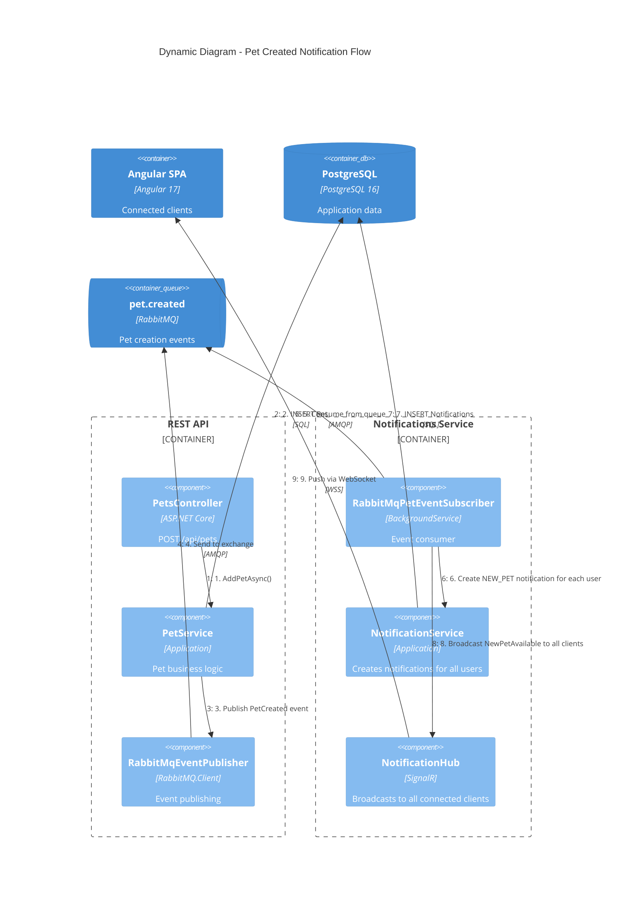
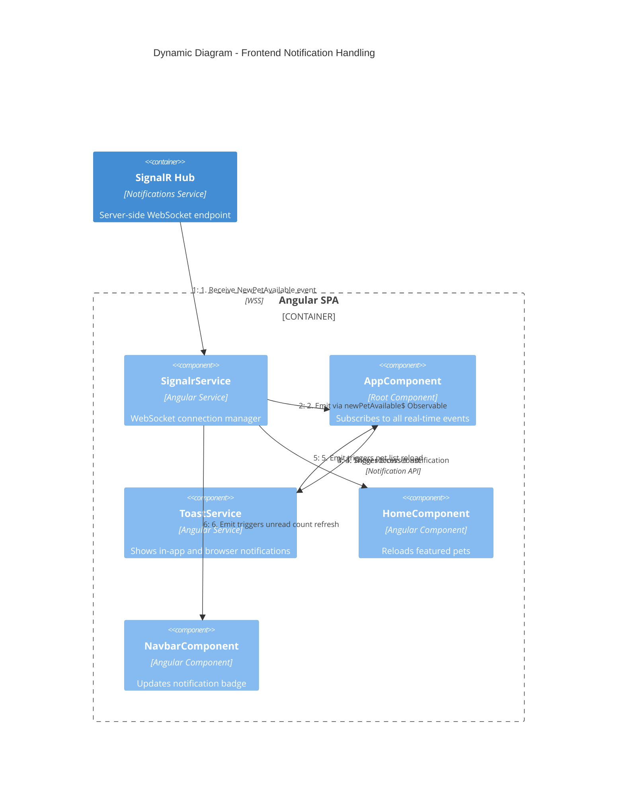

# C4 Dynamic Diagram - Real-Time Notification Flow

This diagram shows how domain events flow from the REST API through RabbitMQ to connected clients via SignalR.

## New Pet Created - Notification Flow



## Frontend Real-Time Handling



## Event Types

| Event | Published By | Consumed By | Notification Type | Recipients | SignalR Method |
|-------|-------------|-------------|-------------------|-----------|----------------|
| PetCreated | PetService | Subscriber | NEW_PET | All users | NewPetAvailable |
| AdoptionRequestCreated | AdoptionRequestService | Subscriber | NEW_REQUEST | All admins | NewAdoptionRequest |
| AdoptionStatusChanged | AdoptionRequestService | Subscriber | ADOPTION_STATUS | Requester only | AdoptionStatusChanged |

## RabbitMQ Topology

```
REST API
   │
   ▼
petfoundation.events (Fanout Exchange)
   │
   ▼
notifications.pets (Queue)
   │
   ▼
Notifications Service (BackgroundService consumer)
```
